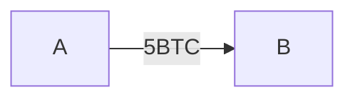

_UTXO와 Account Model은 현금 거래 vs 은행 송금과 유사하다고 볼 수 있습니다._

## 개요

UTXO와 계정 기반 모델은 블록체인 세상에서 가장 인기 있는 두 가지 거래 방법을 말합니다. 두 모델은 블록체인이 거래를 처리하고 기록하는 방법에 대한 두 가지 근본적으로 다른 방식을 나타냅니다. 간단히 말해서, UTXO 모델은 현금 거래와 비슷하게 작동하고, 계좌 기반 모델은 은행 계좌와 비슷하게 작동합니다.

지금부터 UTXO를 알아보고, 계정 기반 모델과 어떤 차이점이 있는지 알아보겠습니다.

## 목차

1. UTXO
   1. 예제로 알아보는 UTXO 모델
   2. UTXO 특징
2. UTXO vs Account Model
   1. UTXO 모델의 장단점
   2. 요약: Account Model과 차이점
3. 결론

## 1. UTXO

비트코인에서 사용하고 있는 모델이 UTXO입니다. Unspent Transaction Output 약자로 사용되지 않은 거래의 출력을 의미합니다.

### [1.1] Hyperledger Chaincode GO 예제로 알아보는 UTXO 모델

하이퍼레저 패브릭에서 공식적으로 지원하는 UTXO 모델 [예제](https://github.com/hyperledger/fabric-samples/tree/main/token-utxo)를 통해 UTXO 모델을 이해해보도록 하겠습니다.

예를 들어, A와 B가 각각 10BTC를 가지고 있고 A가 5BTC를 B에게 주려고 합니다.



결과적으로 봤을 때는 다음과 같이 A는 5BTC를 가지고 있고 B는 15BTC를 가지고 있겠죠.

```plaintext
A가 B에게 5BTC를 송금한다.

A: 5 BTC
B: 15 BTC
```

UTXO는 다음과 같이 트랜잭션을 생성합니다.

1. A는 10BTC를 [발행](https://github.com/hyperledger/fabric-samples/blob/main/token-utxo/chaincode-go/chaincode/token_contract.go#L29-L78)(`Mint`)하여 가지고 있습니다. UTXO로 표현하면 `UTXO(1)=+10BTC`입니다.
2. B 또한 10BTC를 [발행](https://github.com/hyperledger/fabric-samples/blob/main/token-utxo/chaincode-go/chaincode/token_contract.go#L29-L78)(`Mint`)하여 가지고 있습니다. `UTXO(2)=+10BTC`
3. A가 B에게 5BTC [송금 요청](https://github.com/hyperledger/fabric-samples/blob/main/token-utxo/chaincode-go/chaincode/token_contract.go#L81-L189)(`Transfer`)을 보냈습니다. 이 때 UTXO는 A의 전체 [보유 금액을 조회](https://github.com/hyperledger/fabric-samples/blob/main/token-utxo/chaincode-go/chaincode/token_contract.go#L140-L152)하고, [출금](https://github.com/hyperledger/fabric-samples/blob/main/token-utxo/chaincode-go/chaincode/token_contract.go#L159-L172)합니다.
   
   _※ UTXO의 경우 **한 번** 밖에 출력되지 못하기 때문에 전체 금액을 출금(출력)하고 차액을 입금하는 방식을 사용합니다. ※_
4. A는 보유하고 있던 10BTC 중 5BTC를 송금하고 남은 차액을 반환받아야 합니다. 이를 위해 A에게 새로운 트랜잭션인 `UTXO(3)=+5BTC` 가 생성됩니다.
5. B는 A에게 5BTC를 [입금](https://github.com/hyperledger/fabric-samples/blob/main/token-utxo/chaincode-go/chaincode/token_contract.go#L174-L186) 받았습니다. `UTXO(4)=+5BTC`가 생성되었습니다.

| 순서 | 트랜잭션 | 주소 | BTC | 상태 |
| ---- | -------- | ---- | --- | ---- |
| 1    | UTXO(1)  | A    | +10 | 입력 |
| 2    | UTXO(2)  | B    | +10 | 입력 |
| 3    | UTXO(1)  | A    | -10 | 출력 |
| 4    | UTXO(3)  | A    | +5  | 입력 |
| 5    | UTXO(4)  | B    | +5  | 입력 |

최종적으로 `UTXO(1)`은 소멸되었고, `UTXO(2)`와 `UTXO(4)`가 남아있습니다.
이를 이용하여 A와 B의 보유중인 BTC를 계산하려면 UTXO 트랜잭션을 통해 알 수 있습니다.

```plaintext
A의 트랜잭션은 BTXO(3)이기 때문에 5BTC를 소유하고 있습니다.
B의 트랜잭션은 BTXO(2), BTXO(4)이기 때문에 15BTC를 소유하고 있습니다.
```

### [1.2] UTXO 특징

비트코인과 같이 UTXO 모델을 기반으로 하는 블록체인은 **신원 개념이 없습니다.** 중요한 점은 사용자의 잔액을 추적하지 않고 사용되지 않은 거래의 집합으로 표현 된다는 것입니다.

#### 트랜잭션의 입출력 구조

UTXO 모델에서 트랜잭션은 항상 하나 이상의 입력을 소비하고 하나 이상의 출력을 생성합니다. 위의 예제에서 A가 B에게 5 BTC를 송금한 경우, A의 10 BTC UTXO는 하나의 입력으로 사용되고, B의 새로운 5 BTC UTXO와 A의 잔여 5 BTC UTXO가 각각의 출력으로 생성됩니다.

#### 잔액 추적

UTXO 모델에서는 각 사용자의 잔액이 특정 UTXO의 집합으로 표현됩니다. A의 잔액은 A가 소유한 모든 UTXO의 합계로 계산됩니다. 트랜잭션이 발생할 때마다 새로운 UTXO가 생성되고, 사용된 UTXO는 소멸되기 때문에 잔액이 동적으로 변화합니다.

#### 보안 및 무결성

UTXO 모델은 블록체인의 트랜잭션 출력을 사용하여 자산을 추적하고 관리하는 구조로, 보안과 무결성 유지에 중요한 역할을 합니다. 각 트랜잭션 출력이 한 번만 사용될 수 있도록 보장함으로써 이중 지출을 방지하고, 네트워크의 노드들이 UTXO 세트를 유지 관리하면서 트랜잭션의 유효성을 검증하여 블록체인의 신뢰성을 확보합니다.

## 2. UTXO vs Account Model

이더리움은 은행 계좌와 비슷하게 작동하는 계정 기반(Account-Based) 모델을 사용합니다. 계정 기반 모델에서 원장의 상태는 UTXO가 아닌 계정 잔액으로 표현됩니다. 거래는 발신자와 수신자의 계정 잔액을 직접 업데이트하기 때문에 UTXO와 같이 새로운 출력은 생성되지 않습니다.

UTXO와 계정 기반 모델은 각각 장단점이 있습니다. UTXO 모델은 향상된 프라이버시와 확장성을 제공하는 반면, 계정 기반 모델은 단순성과 사용 편의성을 제공합니다. 거래 모델 선택은 특정 암호화폐 프로젝트의 고유한 요구 사항과 목표에 따라 달라집니다.

### [2.1] UTXO 모델의 장단점

UTXO가 계정 모델에 비해 가지는 장점은 확장성이 더 뛰어나고 개인정보 보호가 더 뛰어나다는 점입니다.

#### 확장성

구체적으로, UTXO 기반 블록체인은 병렬로 거래를 처리할 수 있기 때문에 확장성이 더 뛰어납니다. 즉, 채굴자는 모든 거래를 독립적으로 검증하고 동시에 다른 거래를 처리할 수 있습니다. 이는 선형 방식으로 순차적으로 또는 차례로만 거래를 처리할 수 있는 계정 기반 블록체인과 대조적이며, 이는 종종 사용자 수요가 많은 시기에 네트워크 혼잡으로 이어질 수 있습니다.

#### 향상된 프라이버시

프라이버시 측면에서 UTXO 모델은 온체인 아이덴티티[^1]의 개념을 추상화하기 때문에 계정 기반 모델보다 우수합니다. 즉, UTXO 기반 블록체인에서 사용자는 자신이 하거나 받는 모든 거래에 대해 새 주소를 만들도록 권장되므로 제3자가 거래를 개별 사용자와 연결하는 것이 훨씬 더 어려워집니다. 계정 기반 블록체인에서 사용자는 일반적으로 모든 거래에 대해 단일 공개 주소 또는 계정을 사용하므로 온체인 계정을 실제 아이덴티티와 연결하는 것이 훨씬 더 쉽습니다.

#### 복잡성 증가

UTXO 모델의 가장 두드러진 단점은 프로그래밍성이나 스마트 계약 지원이 부족하다는 것입니다. 즉, 비트코인에서 사용되는 표준 UTXO 모델은 간단한 암호화폐 거래만 지원하며 분산형 애플리케이션을 구축하는 데 사용할 수 없습니다. 그러나 Nervos 및 Cardano와 같은 다른 기존 블록체인 프로젝트는 UTXO 모델의 자체 일반화된 버전인 셀 모델과 계정 기반 블록체인보다 더 유연하고 프로그래밍 가능한 확장 UTXO(EUTXO) 모델을 구현했습니다.

### [2.2] 요약: Account Model과 차이점

UTXO 모델의 장단점을 통해 계정 기반 모델과의 차이점은 다음과 같습니다.

1. UTXO 모델에서 암호 지갑은 일반적으로 모든 사용자 거래에 대해 새 주소를 생성하므로 제3자가 거래를 추적하기 어렵습니다. 때문에 단일 계정의 투명하게 잔액이 공개된 계정 모델보다 더 높은 프라이버시를 제공합니다.
2. 트랜잭션을 순차적으로 처리하는 계정 기반 모델과는 다르게, UTXO 모델은 병렬 트랜잭션 처리를 지원합니다.
3. 계정 기반 모델은 일반적으로 개발자가 작업하기에 더 간단합니다. 거래가 계정 간 직접 이체나 스마트 계약에 대한 함수 호출과 유사하기 때문입니다. 이는 기존 프로그래밍 패러다임을 더 밀접하게 모방합니다.

## 3. 결론

결론적으로, UTXO와 계정 기반 블록체인의 차이점은 거래 및 상태를 관리하는 고유한 접근 방식에서 비롯됩니다. UTXO 모델은 사용되지 않은 출력을 추적하고 관련 없는 거래를 동시에 처리하는 데 중점을 둔 구조로 인해 향상된 프라이버시와 병렬성을 제공합니다. 반면, 계정 기반 모델은 계정 및 잔액의 글로벌 상태를 유지하여 거래를 단순화하므로 개발자에게 더 직관적이고 스마트 계약 및 복잡한 애플리케이션에 더 적합합니다.

이러한 모델 간의 미묘한 차이를 이해하는 것은 개발자, 사용자 및 이해관계자가 블록체인 생태계를 구축하거나 참여할 때 정보에 입각한 결정을 내리는 데 매우 중요합니다.

---

## References

- [UTXO vs Account Model](https://www.nervos.org/knowledge-base/utxo_vs_account_based)
- [Hyperledger Fabric | Example for UTXO](https://github.com/hyperledger/fabric-samples/tree/main/token-utxo)

---

[^1]: **온체인 아이덴티티**: 블록체인에 저장된 신원 정보를 말합니다.
